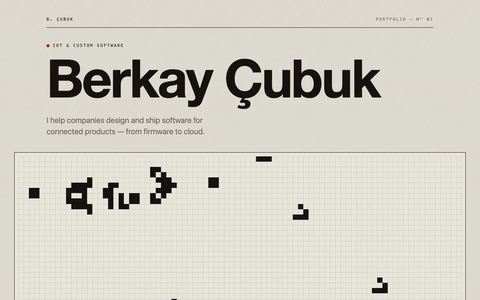
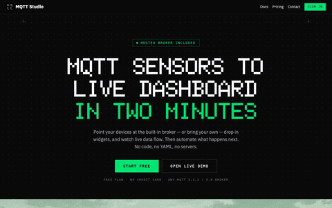
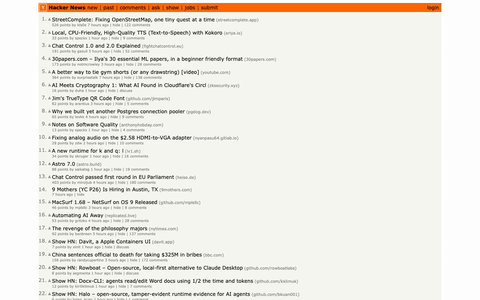

# website-video-capture

Capture sharp 4K / 60fps scrolling videos of website pages — including pages with
live canvas animations (e.g. Conway's Game of Life), which play at true speed
instead of freezing or fast-forwarding. Built for `berkaycubuk.com`, config-driven
so it works for any site.

A single Go binary (`webcap`) driving Chromium via Playwright, encoding with ffmpeg.

## Examples

**berkaycubuk.com** — live capture (the canvas growth animation plays during scroll):



**mqtt.studio** — static scroll with `forceVisible: true` (renders scroll-revealed sections):



**news.ycombinator.com** — static scroll:



## Requirements

- Go 1.26+
- `ffmpeg` + `ffprobe` on `PATH`
- Playwright driver + Chromium
- The target site running somewhere reachable

## Setup

```bash
go build -o webcap .
go run github.com/playwright-community/playwright-go/cmd/playwright@v0.6000.0 install --with-deps chromium
```

## Usage

```bash
./webcap                       # all themes, all pages -> out/videos/*.mp4
./webcap --theme light         # one theme
./webcap --only home,about     # subset of pages
./webcap --base http://localhost:3000
./webcap --no-assemble         # capture frames/stills only
./webcap --assemble-only       # re-encode from existing captures, no browser
```

Subcommands (default is `capture`):

- `webcap capture` — scrolling videos → `out/videos/*.mp4`
- `webcap clips` — fixed-region video clips → `out/clips/*.mp4` (adds `--seconds N`)
- `webcap shots` — high-res region screenshots → `out/shots/*.png` (adds `--scale N`)

Run `webcap --help` for the full flag list.

## How it works

- **Retina** — drives Chromium with a real `deviceScaleFactor` (`1920×1080 @ 2×` → `3840×2160`).
- **Live pages** (`live: true`) — captured frame-by-frame; the page clock advances exactly `1/fps` per frame so canvas/rAF animations run at true speed, deterministically.
- **Static pages** — one full-page screenshot, then a 60fps eased crop-pan synthesized with ffmpeg.

## Config

In `config.go` (`Default()`), or a `config.json` in the working directory
(auto-loaded, or `--config path.json`). JSON overrides the built-in defaults.
Theming sets `localStorage[storageKey]` and toggles `darkClass` on `<html>`.

Per page/clip/shot, `forceVisible: true` forces every element to its final
visible state (overrides scroll-reveal animations that hide below-the-fold
content, which a full-page screenshot would otherwise capture blank). Opt-in —
leave it off for sites that render fine without it (it can interfere with
CSS-transform/animation-based layout).

## Notes

- Runs headless — no desktop/X server needed.
- Live frames: `out/frames/<page>/`; stills: `out/stills/`. Use `--assemble-only` to re-encode without recapturing.
- `out/` and the `webcap` binary are git-ignored.
